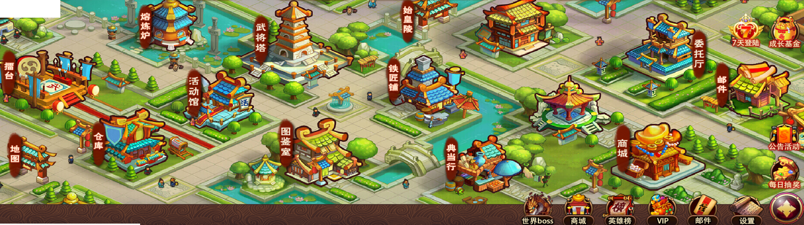
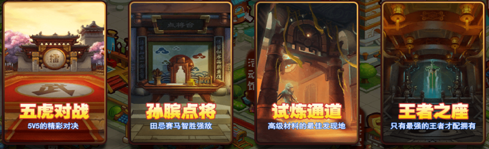
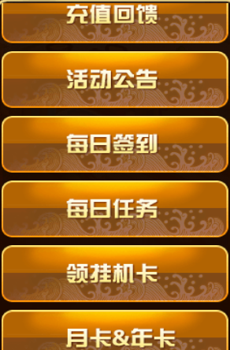

主界面介绍
---------

.. note::

  游戏里主界面是可以左右滑动的,这里放的是全景图！



擂台-分成四大块
=============

   
五虎对战
```````
出战五名武将和本区玩家对战，获胜得威望等奖品，威望用于提升英雄榜排名。

孙膑点将
```````
出战三队各五名武将，三局两胜制

试炼通道
```````
地宫必须通过120层，有三个金色武将，掉落材料用于神兵合成

王者之座
```````
地宫必须通过20层，挑战玩家提升王者之座排名，每日根据排名发放两次功勋奖励

地图
====
三星通过地图解锁装备，后期地图会有武将限制提高难度

熔炼炉
=====
合成宝石的界面

仓库
====
查看物品 （安卓将魂和碎片页面点进去不显示第一排，上滑查看）

活动馆
====

主要功能如下:

充值回馈
```````

每日签到
```````

每日任务
```````

领取挂机卡
`````````

月卡，年卡
`````````

武将塔
=====
查看已拥有武将，配置武将装备

图鉴室
=====
查看所有武将相关信息，包括神兵和将魂获取途径等

始皇陵
=====
地宫，一层层挑战通过后解锁下一层,每层可以抽取奖励

铁匠铺
=====
武将神兵合成处

典当行
=====
典当部分物品，赎回价格会更高

商城
=====
购买各种道具，促销活动会变动

委托厅
=====
完成任务提高小兵攻击力

邮件
====
邮件系统

世界boss
=======
每日21：00开启15分钟，根据伤害排名发放宝箱

英雄榜
=====
每周根据排名发放奖励

成长基金
=======
通过不同地图和地宫关卡，可以领取对应钻石，前期主要钻石来源
