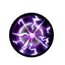

技能介绍
=======
3级主技能
--------
星落
````
3级主动技：从天召唤陨石，击晕敌军持续3秒，发动4倍攻击1次，攻击范围内敌人[消耗魂量:50]


无双
````
3级主动技：自身攻击速度+100%，攻击范围+30%持续15秒[消耗魂量:45]

.. image:: images/skills/wushuang.png

狂战
````
3级主动技：范围内，己方武将士兵，攻速+40%，持续15秒[消耗魂量:35]


鹰眼
````
3级主动技：范围内，士兵攻击范围扩大2倍，持续30秒[消耗魂量:45]


暴雷闪
````
3级主动技：召唤暴雷闪电，发动武将攻击力6倍的闪电攻击1次，攻击范围内敌人[消耗魂量:45]

.. image:: images/skills/baoleishan.png

醉魂香
````
3级主动技：闻此香，敌军速度减-50%持续8秒，发动1倍攻击1次，攻击范围内敌人[消耗魂量:32]


战争践踏
````
3级主动技：猛击地面，击晕敌军持续10秒，发动1倍攻击1次，攻击范围内敌人[消耗魂量:55]


长枪突刺
````
3级主动技：长枪攻击范围内敌人，眩晕4秒，防御-50%，2倍伤害[消耗魂量:50]


万夫莫敌
````
3级主动技：自身攻击速度+40%，攻击力+40%持续20秒[消耗魂量:36]


魔力反噬
````
3级主动技：消耗70魂，换取100粮食[消耗魂量:70]


鼓舞士气
````
3级主动技：范围内，己方武将士兵，攻击+40%，持续15秒[消耗魂量:39]


清扫战场
````
3级主动技：已方兵将杀敌获得的粮食增加3点，持续20秒[消耗魂量:30]


强击光环
````
3级主动技：范围内，己方士兵获得武将自身5%攻击，持续30秒[消耗魂量:50]


乾坤斗转
````
3级主动技：将最靠近终点的5个敌方兵将，传送回原起点。[消耗魂量:80]


冰河爆裂破
````
3级主动技：冰冻敌军，防御-40%持续6秒，发动1倍攻击1次，攻击范围内敌人[消耗魂量:37]


被动技能
-------
重击
````
被动技：10%机率击晕5秒[被动技能不消耗魂量]


霸气
````
被动技：20%几率击晕5秒[被动技能不消耗魂量]


穿刺
````
被动技：15%机率破坏敌方铠甲防御-100%，持续6秒[被动技能不消耗魂量]

.. image:: images/skills/chuanci.png

魅惑
````
被动技：15%机率眩晕目标，持续6秒[被动技能不消耗魂量]


爆气
````
被动技：15%机率，范围内己方兵将攻击+30%，持续10秒[被动技能不消耗魂量]


血祭
````
被动技：20%机率减少目标生命30%[被动技能不消耗魂量]

.. image:: images/skills/xueji.png

破盾
````
被动技：10%机率破除敌方遁甲状态[被动技能不消耗魂量]



迷惑
````
被动技：攻击时10%机率使范围内所有敌人速度-50%持续5秒[被动技能不消耗魂量]


闪电斩
````
被动技：10%机率减少目标90%生命[被动技能不消耗魂量]


神速符
````
被动技：15%机率给范围内己方兵将攻速+40%，持续10秒[被动技能不消耗魂量]


摄魂幡
````
被动技：20%机率吸魂量+100%，持续10秒(在谋士中先上场有效)[被动技能不消耗魂量]


倾国倾城
````
被动技：20%机率眩晕目标，防御-50%,持续5秒[被动技能不消耗魂量]


9级主技能
--------
星落
````
9级主动技：从天召唤陨石，击晕敌军持续6秒，发动8倍攻击1次，攻击所有敌人[消耗魂量:110]


无双
````
9级主动技：自身攻击速度+200%，攻击范围+60%持续30秒[消耗魂量:130]

.. image:: images/skills/wushuang.png

狂战
````
9级主动技：范围内，己方武将士兵，攻速+70%，持续30秒[消耗魂量:90]


鹰眼
````
9级主动技：范围内，士兵攻击范围扩大3倍，持续100秒[消耗魂量:90]


暴雷闪
````
9级主动技：召唤暴雷闪电，发动武将攻击力10倍的闪电攻击1次，攻击所有敌人[消耗魂量:90]

.. image:: images/skills/baoleishan.png

醉魂香
````
9级主动技：闻此香，敌军速度减-80%持续20秒，发动1倍攻击1次，全屏敌人[消耗魂量:80]


战争践踏
````
9级主动技：猛击地面，击晕敌军持续20秒，发动1倍攻击1次，攻击所有敌人[消耗魂量:120]


长枪突刺
````
9级主动技：长枪攻击所有敌人，眩晕10秒，防御-100%，3倍伤害[消耗魂量:115]


万夫莫敌
````
9级主动技：自身攻击速度+80%，攻击力+80%持续40秒[消耗魂量:110]


魔力反噬
````
9级主动技：消耗200魂，换取400粮食[消耗魂量:200]


鼓舞士气
````
9级主动技：范围内，己方武将士兵，攻击+70%，持续30秒[消耗魂量:95]


清扫战场
````
9级主动技：已方兵将杀敌获得的粮食增加5点，持续35秒[消耗魂量:70]


强击光环
````
9级主动技：范围内，己方士兵获得武将自身6%攻击，持续100秒[消耗魂量:150]


乾坤斗转
````
9级主动技：将最靠近终点的15个敌方兵将，传送回原起点。[消耗魂量:200]


冰河爆裂破
````
9级主动技：冰冻敌军，防御-100%持续10秒，发动1倍攻击1次，攻击全屏敌人[消耗魂量:95]


