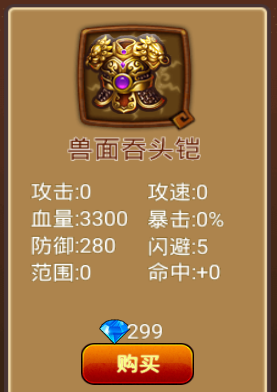
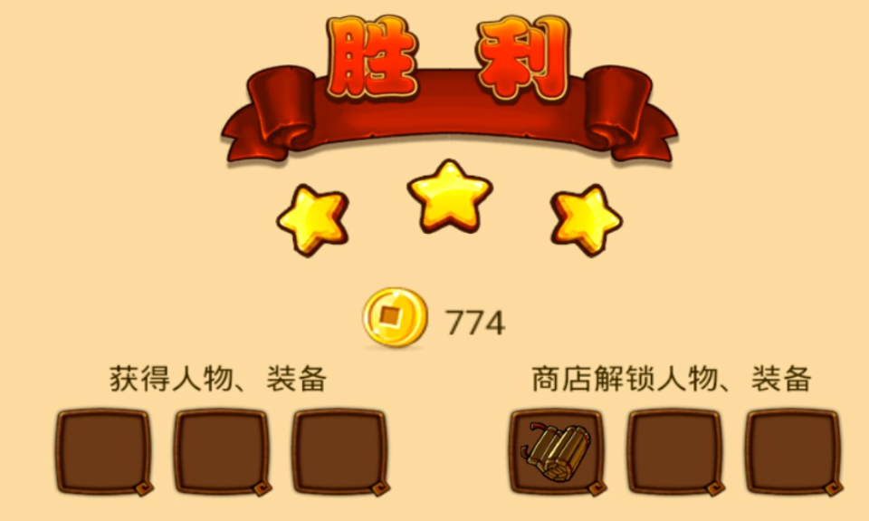

vip0 账号记录
------------

vip0新开号
=========
.. image:: images/newplayerrewards/greet.png
  :width: 700px
  :height: 400px 
  
初始界面

前期的钻石来源主要在成长基金里，通过地图，三星地图和通过地宫层数都有钻石奖励。

个人觉得前五章，总共三十关没有什么难度。这也是这一类塔防游戏的前期简单关卡，不需要提供详细攻略，自己慢慢探索更有乐趣。在这里就放下这些关卡每官三星后解锁的装备和武将（只有三星才会解锁：一个兵都不漏；满20命结束关卡)。只要解锁了新图，买适当的武器和选好武将 前面的这些图都是直通，武将下场后在路上摆兵就能过。


  
初始商城给出的武将


  
.. image:: images/newplayerrewards/zhugeyushan.png
  :width: 275px
  :height: 200px 
  


新手福利
 
地图1-30关
=========

第1关 
````
.. image:: images/maps/map1/r.png
  :width: 700px
  :height: 350px 
  


第2关 
````

  

  
.. image:: images/maps/map2/i2.png
  :width: 200px
  :height: 300px 

第3关 
````

  

  

  

  
.. image:: images/maps/map3/i4.png
  :width: 200px
  :height: 300px 

第4关 
````

  

  
.. image:: images/maps/map4/i2.png
  :width: 200px
  :height: 300px 
  

  


第5关 
````
.. image:: images/maps/map5/r.png
  :width: 700px
  :height: 350px 
  

  


第6关 
````
.. image:: images/maps/map6/r.png
  :width: 700px
  :height: 350px 
  
.. image:: images/maps/map6/i1.png
  :width: 200px
  :height: 300px 
  

  
.. image:: images/maps/map6/i3.png
  :width: 200px
  :height: 300px 

第7关 
````
.. image:: images/maps/map7/r.png
  :width: 700px
  :height: 350px 
  

  
.. image:: images/maps/map7/i2.png
  :width: 200px
  :height: 300px 
  


第8关 
````
.. image:: images/maps/map8/r.png
  :width: 700px
  :height: 350px 
  
.. image:: images/maps/map8/i1.png
  :width: 200px
  :height: 300px 

第9关 
````

  
.. image:: images/maps/map9/i1.png
  :width: 200px
  :height: 300px 
  
.. image:: images/maps/map9/i2.png
  :width: 200px
  :height: 300px 

第10关 
````

  
.. image:: images/maps/map10/i1.png
  :width: 200px
  :height: 300px 
  


第11关 
````
.. image:: images/maps/map11/r.png
  :width: 700px
  :height: 350px 
  
.. image:: images/maps/map11/i1.png
  :width: 200px
  :height: 300px 
  
.. image:: images/maps/map11/i2.png
  :width: 200px
  :height: 300px 
  
.. image:: images/maps/map11/i3.png
  :width: 200px
  :height: 300px 

第12关 
`````
.. image:: images/maps/map12/r.png
  :width: 700px
  :height: 350px 
  

  
.. image:: images/maps/map12/i2.png
  :width: 200px
  :height: 300px 
  
.. image:: images/maps/map12/i3.png
  :width: 200px
  :height: 300px 

第13关 
`````

  
.. image:: images/maps/map13/i1.png
  :width: 200px
  :height: 300px 
  

  


第14关 
`````

  
.. image:: images/maps/map14/i1.png
  :width: 200px
  :height: 300px 
  

  


第15关 
`````

  

  


第16关 
`````

  

  


第17关 
`````
.. image:: images/maps/map17/r.png
  :width: 700px
  :height: 350px 
  
第18关 
`````

  
.. image:: images/maps/map18/i1.png
  :width: 200px
  :height: 300px 

第19关 
`````
.. image:: images/maps/map19/r.png
  :width: 700px
  :height: 350px 
  

  
.. image:: images/maps/map19/i2.png
  :width: 200px
  :height: 300px 

第20关 
`````
.. image:: images/maps/map20/r.png
  :width: 700px
  :height: 350px 
  
.. image:: images/maps/map20/i1.png
  :width: 200px
  :height: 300px 
  
.. image:: images/maps/map20/i2.png
  :width: 200px
  :height: 300px 
  


第21关 
`````

  

  
.. image:: images/maps/map21/i2.png
  :width: 200px
  :height: 300px 

第22关 
`````

  
.. image:: images/maps/map22/i1.png
  :width: 200px
  :height: 300px 
  


第23关 
`````
.. image:: images/maps/map23/r.png
  :width: 700px
  :height: 350px 
  
.. image:: images/maps/map23/i1.png
  :width: 200px
  :height: 300px 

第24关 
`````

  
第25关 
`````


第26关 
`````
.. image:: images/maps/map26/r.png
  :width: 700px
  :height: 350px 

第27关 
`````
.. image:: images/maps/map27/r.png
  :width: 700px
  :height: 350px 

第28关 
`````

  

  
第29关 
`````
.. image:: images/maps/map29/r.png
  :width: 700px
  :height: 350px 
  
.. image:: images/maps/map29/i1.png
  :width: 200px
  :height: 300px 

第30关 
`````

  


