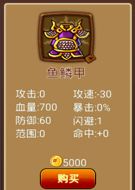

vip0 账号记录
------------

vip0新开号
=========

  
初始界面

前期的钻石来源主要在成长基金里，通过地图，三星地图和通过地宫层数都有钻石奖励。

个人觉得前五章，总共三十关没有什么难度。这也是这一类塔防游戏的前期简单关卡，不需要提供详细攻略，自己慢慢探索更有乐趣。在这里就放下这些关卡每官三星后解锁的装备和武将（只有三星才会解锁：一个兵都不漏；满20命结束关卡)。只要解锁了新图，买适当的武器和选好武将 前面的这些图都是直通，武将下场后在路上摆兵就能过。

.. image:: images/newplayerrewards/huanggai.png
  :width: 275px
  :height: 400px 

.. image:: images/newplayerrewards/simayi.png
  :width: 275px
  :height: 400px 
  
初始商城给出的武将

.. image:: images/newplayerrewards/7dayrewards.png
  :width: 575px
  :height: 300px 
  

  
.. image:: images/newplayerrewards/zhugeliang.png

新手福利

新号玩法推荐，获取资源详解
=======================

武将颜色和神兵的升级路线
``````````````````````
1.所有武将无论什么颜色都要升到6级再推图，因为6级开始才能解锁被动技。

2.太史慈: 白色6级即可，白神兵都不用，就可以用到64图，之后就换黄忠。

3.许诸: 白色6级即可，白神兵都不用，就可以用到72图，之后就换诸葛亮控兵。 注: 想玩得舒服的，也可以锻造一下白神兵再推图，毕竟几个转生石就能加几十范围，想省资源的就不用。

4.小乔: 绿色6级+白神兵，用到100图绰绰有余。 4.荀攸: 先锻造白神兵，再尽快转生并升级到金色五星。

5.关平：最少需要4420功勋在王者之座商城换取3x17=51个将魂，用50个在图鉴室召唤。神兵碎片也需要用功勋兑换。V0神将没有之一。培养路线为: 先锻造白神兵和绿神兵，绿神兵选择攻击，每获得一个5级绿宝石，就做一孔五级速成攻击1.1.1.1.1（1个五级宝石，1个神兵碎片，1个将魂，1个精炼石，1个进阶丹,0个转生石)，在这期间转颜色。蓝5关平+绿神兵速成攻击做完之后，开始做蓝神兵增伤，配方推荐99.36.36.99.99（99个四级宝石，36个神兵碎片，36个将魂，99个精炼石，99个进阶丹,0个转生石)。关平蓝神兵增伤做大约两三孔，就把蓝神兵的孔全部打完，转生到紫神兵做五级速成格挡，关平同时也要尽快转生到紫色五星。格挡做完之后开始补蓝神兵没做完的增伤，然后关平尽快转生到红色五星。(也可以蓝神兵格挡，紫神兵增伤，主要看推图进度)。

武将要如何配置和站位
``````````````````
荀攸，作用在双吸，当双吸被动技触发且小兵在荀攸范围内阵亡，荀攸可以吸到双倍魂，也就是3*2=6。为了尽可能的吸到更多的魂，荀攸范围越大越好，因此荀攸，配置:大范围装备，全上蓝宝石；站位: 在能覆盖飞兵路线的情况下，覆盖尽可能多的地兵路线。

如何知道飞兵路线? 可以先不要求三星，前3波随便打，打到第3波就知道了，然后可以开始思考最佳站位和范围配置，再重新打三星。

为什么荀攸最好要覆盖飞兵路线? 一波飞兵10个，双吸60魂，无双吸30魂，这样打到20波就差了300魂。这可能就是最后几波能不能过得去的关键。总之就是尽可能多吸魂。

前百图武将配置
`````````````
1-64图: 荀攸，许诸，关平，太史慈，小乔。

65-72图:荀攸，许诸，关平，黄忠，小乔。

73-83图:荀攸，诸葛亮，关平，黄忠，小乔。

84-89图:荀攸，诸葛亮，关平，黄忠，小乔。

90-99图:荀攸，诸葛亮，关平，黄忠，小乔。

主要分为这5个阶段。其中65-72用的是64图配置；73-83用的是75图配置；84-89用的是84图的配置；90-99用的是90图的配置。而64，75，84，86，90难度较大的图都有单开的贴子，有详细攻略和配置，认真看了到百图不难。

64图：http://c.tieba.baidu.com/p/7761593685

75图：http://c.tieba.baidu.com/p/7786555473

84图：http://c.tieba.baidu.com/p/7815518155

86图：http://c.tieba.baidu.com/p/7817399749

90图：http://c.tieba.baidu.com/p/7822844352

贴吧福兴包子大佬的原百度贴吧贴子链接：http://c.tieba.baidu.com/p/7826499147


前期简单地图1-30关
================

第1关 
````
.. image:: images/maps/map1/r.png
  :width: 700px
  :height: 350px 
  
.. image:: images/maps/map1/i1.png
  :width: 200px
  :height: 300px 

第2关 
````
.. image:: images/maps/map2/r.png
  :width: 700px
  :height: 350px 
  
.. image:: images/maps/map2/i1.png
  :width: 200px
  :height: 300px 
  


第3关 
````
.. image:: images/maps/map3/r.png
  :width: 700px
  :height: 350px 
  
.. image:: images/maps/map3/i1.png
  
.. image:: images/maps/map3/i2.png
  :width: 200px
  :height: 300px 
  
.. image:: images/maps/map3/i3.png
  :width: 200px
  :height: 300px 
  


第4关 
````
.. image:: images/maps/map4/r.png
  :width: 700px
  :height: 350px 
  
.. image:: images/maps/map4/i1.png
  

  
.. image:: images/maps/map4/i3.png
  :width: 200px
  :height: 300px 
  
.. image:: images/maps/map4/i4.png
  :width: 200px
  :height: 300px 

第5关 
````

  
.. image:: images/maps/map5/i1.png
  :width: 200px
  :height: 300px 
  
.. image:: images/maps/map5/i2.png
  :width: 200px
  :height: 300px 

第6关 
````

  

  
.. image:: images/maps/map6/i2.png
  :width: 200px
  :height: 300px 
  


第7关 
````

  
.. image:: images/maps/map7/i1.png
  :width: 200px
  :height: 300px 
  

  
.. image:: images/maps/map7/i3.png
  :width: 200px
  :height: 300px

第8关 
````

  


第9关 
````
.. image:: images/maps/map9/r.png
  :width: 700px
  :height: 350px 
  

  


第10关 
````
.. image:: images/maps/map10/r.png
  :width: 700px
  :height: 350px 
  

  
.. image:: images/maps/map10/i2.png
  :width: 200px
  :height: 300px 

第11关 
````

  

  

  


第12关 
`````

  
.. image:: images/maps/map12/i1.png
  :width: 200px
  :height: 300px 
  

  


第13关 
`````
.. image:: images/maps/map13/r.png
  :width: 700px
  :height: 350px 
  

  
.. image:: images/maps/map13/i2.png
  :width: 200px
  :height: 300px 
  
.. image:: images/maps/map13/i3.png
  :width: 200px
  :height: 300px 

第14关 
`````
.. image:: images/maps/map14/r.png
  :width: 700px
  :height: 350px 
  
.. image:: images/maps/map14/i1.png
  :width: 200px
  :height: 300px 
  
.. image:: images/maps/map14/i2.png
  :width: 200px
  :height: 300px 
  
.. image:: images/maps/map14/i3.png
  :width: 200px
  :height: 300px 

第15关 
`````
.. image:: images/maps/map15/r.png
  :width: 700px
  :height: 350px 
  
.. image:: images/maps/map15/i1.png
  :width: 700px
  
.. image:: images/maps/map15/i2.png
  :width: 200px
  :height: 300px

第16关 
`````
.. image:: images/maps/map16/r.png
  :width: 700px
  :height: 350px 
  
.. image:: images/maps/map16/i1.png
  :width: 200px
  :height: 300px 
  
.. image:: images/maps/map16/i2.png
  :width: 200px
  :height: 300px 

第17关 
`````

  
第18关 
`````
.. image:: images/maps/map18/r.png
  :width: 700px
  :height: 350px 
  


第19关 
`````

  
.. image:: images/maps/map19/i1.png
  :width: 200px
  :height: 300px 
  


第20关 
`````

  

  

  
.. image:: images/maps/map20/i3.png
  :width: 200px
  :height: 300px 

第21关 
`````
.. image:: images/maps/map21/r.png
  :width: 700px
  :height: 350px 
  
.. image:: images/maps/map21/i1.png
  :width: 200px
  :height: 300px 
  


第22关 
`````
.. image:: images/maps/map22/r.png
  :width: 700px
  :height: 350px 
  

  
.. image:: images/maps/map22/i2.png
  :width: 200px
  :height: 300px 

第23关 
`````

  


第24关 
`````
.. image:: images/maps/map24/r.png
  :width: 700px
  :height: 350px
  
第25关 
`````
.. image:: images/maps/map25/r.png
  :width: 700px
  :height: 350px 

第26关 
`````
.. image:: images/maps/map26/r.png
  :width: 700px
  :height: 350px 

第27关 
`````


第28关 
````
.. image:: images/maps/map28/r.png
  :width: 700px
  :height: 350px 

.. image:: images/maps/map28/i1.png

第29关 
````


第30关 
````
.. image:: images/maps/map30/r.png
  :width: 700px
  :height: 350px 

.. image:: images/maps/map30/i1.png
  :width: 200px
  :height: 300px 


